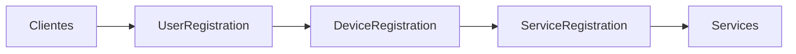

# Análise Completa do Sistema Paulo Cell

## 📱 Visão Geral do Projeto

**Nome**: Paulo Cell - Sistema de Gerenciamento de Assistência Técnica  
**Tipo**: Aplicação Web (React + TypeScript + Vite)  
**Backend**: Supabase (PostgreSQL + Auth + Storage)  
**Organização**: Paulo Cell  
**Região**: sa-east-1 (São Paulo, Brasil)

## 🗄️ Estrutura do Banco de Dados

### Conexão Supabase
- **Projeto ID**: kpfxdnvngsvckuubyhic
- **Host**: db.kpfxdnvngsvckuubyhic.supabase.co
- **Versão PostgreSQL**: 17.6.1.003
- **Status**: ACTIVE_HEALTHY

### 📊 Tabelas Principais

#### 1. **customers** (Clientes)
**Registros**: 1,426 clientes  
**RLS**: Habilitado ✓

**Campos**:
```typescript
{
  id: uuid (PK),
  name: varchar,
  document_type: varchar (cpf/cnpj),
  document: varchar,
  phone: varchar,
  email: varchar,
  // Endereço
  cep: varchar,
  state: varchar,
  city: varchar,
  neighborhood: varchar,
  street: varchar,
  number: varchar,
  complement: varchar,
  // Metadados
  created_at: timestamptz,
  updated_at: timestamptz,
  organization_id: uuid (FK)
}
```

**Relacionamentos**:
- → `devices` (1:N) - Um cliente pode ter múltiplos dispositivos
- → `services` (1:N) - Um cliente pode ter múltiplos serviços
- → `sales` (1:N) - Um cliente pode ter múltiplas vendas
- → `fiscal_documents` (1:N) - Um cliente pode ter múltiplos documentos fiscais

---

#### 2. **devices** (Dispositivos)
**Registros**: 1,418 dispositivos  
**RLS**: Habilitado ✓

**Campos**:
```typescript
{
  id: uuid (PK),
  customer_id: uuid (FK → customers),
  device_type: varchar ('smartphone', 'notebook', 'tablet'),
  brand: varchar,
  model: varchar,
  serial_number: varchar (nullable),
  imei: varchar (nullable),
  color: varchar (nullable),
  condition: varchar ('good', 'minor_issues', 'critical_issues'),
  // Senha do Dispositivo
  password_type: varchar ('none', 'pin', 'pattern', 'password', 'biometric'),
  password: varchar (nullable),
  observations: text (nullable),
  // Metadados
  created_at: timestamptz,
  updated_at: timestamptz,
  organization_id: uuid (FK)
}
```

**Relacionamentos**:
- ← `customers` (N:1) - Pertence a um cliente
- → `services` (1:N) - Um dispositivo pode ter múltiplos serviços

**Observação Importante**: 
- O campo `password` armazena a senha em formato texto
- Para `password_type = 'pattern'`: armazena como "1,4,7,8" (índices do grid 3x3)
- Para outros tipos: armazena texto livre

---

#### 3. **services** (Serviços/Ordens de Serviço)
**Registros**: 1,378 serviços  
**RLS**: Habilitado ✓

**Campos**:
```typescript
{
  id: uuid (PK),
  device_id: uuid (FK → devices),
  customer_id: uuid (FK → customers),
  // Tipo de Serviço
  service_type: varchar (
    'screen_repair', 'battery_replacement', 'water_damage',
    'software_issue', 'charging_port', 'button_repair',
    'camera_repair', 'mic_speaker_repair', 'diagnostics',
    'unlocking', 'data_recovery', 'other'
  ),
  other_service_description: text (nullable),
  // Informações do Serviço
  technician_id: varchar (nullable),
  status: varchar (default: 'pending'),
  price: numeric,
  estimated_completion_date: timestamptz (nullable),
  // Garantia
  warranty_period: varchar (nullable),
  warranty_until: timestamptz (nullable),
  observations: text (nullable),
  // Histórico de Status
  pending_date: timestamptz (nullable),
  in_progress_date: timestamptz (nullable),
  waiting_parts_date: timestamptz (nullable),
  completed_date: timestamptz (nullable),
  delivery_date: timestamptz (nullable),
  // Pagamento
  payment_method: text (nullable),
  priority: varchar (default: 'normal'),
  // Rastreamento Público
  public_tracking_id: uuid (nullable),
  public_notes: text (nullable),
  // Metadados
  created_at: timestamptz,
  updated_at: timestamptz,
  organization_id: uuid (FK)
}
```

**Status Possíveis**:
1. `pending` - Pendente (amarelo)
2. `in_progress` - Em andamento (azul)
3. `waiting_parts` - Aguardando peças (roxo)
4. `completed` - Concluído (verde)
5. `delivered` - Entregue (cinza)

**Métodos de Pagamento**:
- `pending` - Pagamento Pendente
- `credit` - Crédito
- `debit` - Débito
- `pix` - Pix
- `cash` - Espécie

**Relacionamentos**:
- ← `devices` (N:1) - Pertence a um dispositivo
- ← `customers` (N:1) - Pertence a um cliente
- → `sales` (1:1) - Pode ter uma venda associada
- → `service_status_views` (1:N) - Histórico de visualizações

---

#### 4. **inventory** (Estoque)
**Registros**: 147 itens  
**RLS**: Habilitado ✓

**Campos**:
```typescript
{
  id: uuid (PK),
  name: varchar,
  sku: varchar (unique),
  category: varchar,
  custom_category: varchar (nullable),
  compatibility: varchar (nullable),
  cost_price: numeric,
  selling_price: numeric,
  quantity: integer (default: 0),
  minimum_stock: integer (default: 0),
  item_type: varchar ('part', 'product'),
  // Metadados
  created_at: timestamptz,
  updated_at: timestamptz,
  organization_id: uuid (FK)
}
```

**Tipos de Item**:
- `part` - Peça para reparo
- `product` - Produto para venda

**Relacionamentos**:
- → `sale_items` (1:N) - Itens vendidos
- → `inventory_movements` (1:N) - Movimentações de estoque

---

#### 5. **sales** (Vendas/PDV)
**Registros**: 4 vendas  
**RLS**: Habilitado ✓

**Campos**:
```typescript
{
  id: uuid (PK),
  sale_number: varchar (unique),
  customer_id: uuid (FK → customers, nullable),
  customer_name: varchar,
  customer_document: varchar (nullable),
  // Valores
  total_amount: numeric (default: 0),
  discount_amount: numeric (default: 0),
  final_amount: numeric (default: 0),
  // Pagamento
  payment_method: varchar ('cash', 'credit', 'debit', 'pix', 'multiple'),
  payment_status: varchar ('pending', 'paid', 'partial', 'cancelled'),
  // Tipo e Status
  sale_type: varchar ('retail', 'wholesale', 'service'),
  status: varchar ('draft', 'confirmed', 'delivered', 'cancelled'),
  notes: text (nullable),
  // Relacionamentos
  seller_id: uuid (FK → profiles, nullable),
  service_id: uuid (FK → services, nullable),
  organization_id: uuid (FK),
  // Metadados
  created_at: timestamptz,
  updated_at: timestamptz
}
```

**Relacionamentos**:
- ← `customers` (N:1, nullable) - Cliente da venda
- ← `profiles` (N:1, nullable) - Vendedor
- ← `services` (N:1, nullable) - Serviço relacionado
- → `sale_items` (1:N) - Itens da venda
- → `sale_payments` (1:N) - Pagamentos da venda

---

#### 6. **organizations** (Organizações)
**Registros**: 13 organizações  
**RLS**: Habilitado ✓

**Campos**:
```typescript
{
  id: uuid (PK),
  name: text,
  // Configurações PIX
  pix_key: text (nullable),
  pix_key_type: text ('cpf', 'cnpj', 'email', 'phone', 'random'),
  merchant_name: text (default: 'PAULO CELL'),
  merchant_city: text (default: 'VITORIA'),
  // PagBank
  pagbank_api_key: text (nullable),
  payment_settings: jsonb (default: {}),
  // Metadados
  created_at: timestamptz,
  updated_at: timestamptz
}
```

---

#### 7. **profiles** (Perfis de Usuário)
**Registros**: 3 usuários  
**RLS**: Habilitado ✓

**Campos**:
```typescript
{
  id: uuid (PK, FK → auth.users),
  name: text,
  email: text,
  role: text (default: 'user'),
  avatar_url: text (nullable),
  phone: text (nullable),
  // Dados da Empresa
  organization_id: uuid (FK),
  company_name: text (nullable),
  document_type: text ('cpf', 'cnpj'),
  document: text (nullable),
  // Endereço
  cep: text,
  state: text,
  city: text,
  neighborhood: text,
  street: text,
  number: text,
  complement: text (nullable),
  // Metadados
  registration_step: integer (default: 1),
  created_at: timestamptz,
  updated_at: timestamptz
}
```

---

### 📈 Outras Tabelas

#### 8. **fiscal_documents** (Documentos Fiscais)
- **Registros**: 0
- Tipos: NF, NFCe, NFS
- Status: authorized, pending, canceled

#### 9. **documentos** (Documentos - Tabela Alternativa)
- **Registros**: 33
- Tipos: NF, NFCe, NFS
- Inclui: chave de acesso, PDF URL, protocolo

#### 10. **notifications** (Notificações)
- **Registros**: 18
- Tipos: service, inventory, payment, document, system

#### 11. **service_status_views** (Visualizações de Status)
- **Registros**: 139
- Rastreamento de visualizações públicas de serviços

#### 12. **sale_items** (Itens de Venda)
- **Registros**: 4
- Detalhamento dos itens vendidos

#### 13. **inventory_movements** (Movimentações de Estoque)
- **Registros**: 0
- Tipos: in, out, adjustment

---

## 🔧 Funções RPC (Remote Procedure Calls)

### 1. `search_services()`
**Função**: Busca avançada de serviços com filtros

**Parâmetros**:
```sql
search_term: text,           -- Busca textual
org_id: uuid,                -- ID da organização
status_filter: text,         -- Filtro de status
payment_filter: text,        -- Filtro de pagamento
date_filter: timestamptz,    -- Filtro de data
page_offset: integer,        -- Paginação (offset)
page_limit: integer          -- Paginação (limite)
```

**Retorno**: 
- Lista de serviços com dados completos de cliente e dispositivo
- Inclui: `device_password_type` (corrigido recentemente ✓)

**Uso**: 
- Página de Serviços (`Services.tsx`)
- Busca em tempo real com debounce de 300ms
- Suporte a scroll infinito (20 registros por vez)

### 2. `update_service_status()`
**Função**: Atualiza o status de um serviço e registra o histórico

**Parâmetros**:
```sql
p_service_id: uuid,          -- ID do serviço
p_organization_id: uuid,     -- ID da organização
p_status: text               -- Novo status
```

**Comportamento**:
- Atualiza o campo `status`
- Registra a data da mudança no campo correspondente:
  - `pending_date`
  - `in_progress_date`
  - `waiting_parts_date`
  - `completed_date`
  - `delivery_date`

---

## 🎨 Frontend - Estrutura de Componentes

### 📂 Estrutura de Pastas

```
src/
├── components/          # Componentes reutilizáveis
│   ├── ui/             # Componentes de UI (shadcn/ui)
│   ├── PatternLock.tsx        # Input para desenhar senha padrão
│   ├── PatternLockDisplay.tsx # Exibição do padrão de senha
│   ├── ServiceActionsMenu.tsx # Menu de ações de serviço
│   ├── BluetoothPrinter.tsx   # Impressão Bluetooth
│   └── ...
├── contexts/           # Context API
│   ├── AuthContext.tsx
│   ├── CompanyContext.tsx
│   ├── SidebarContext.tsx
│   └── ThemeContext.tsx
├── pages/              # Páginas principais
│   ├── Services.tsx           # Lista de serviços
│   ├── DeviceRegistration.tsx # Cadastro de dispositivo
│   ├── Clients.tsx            # Lista de clientes
│   ├── Inventory.tsx          # Estoque
│   ├── Sales.tsx              # PDV/Vendas
│   └── ...
├── integrations/       # Integrações
│   └── supabase/
└── lib/               # Utilitários
    ├── pix-utils.ts
    ├── qrcode-utils.ts
    └── ...
```

### 🧩 Componentes Principais

#### 1. **PatternLock.tsx**
**Função**: Input interativo para desenhar senha padrão  
**Usado em**: Cadastro de dispositivo

**Funcionalidades**:
- Canvas interativo 3x3
- Desenho com mouse ou touch
- Validação de sequência mínima
- Botão de limpar

#### 2. **PatternLockDisplay.tsx** ⭐
**Função**: Exibição visual do padrão de senha  
**Usado em**: 
- Modal de detalhes do serviço
- Página de cadastro de dispositivo (pré-visualização)

**Funcionalidades**:
- Renderização em Canvas
- Linhas conectando os pontos
- Setas indicando direção
- Numeração da sequência
- Grid visual 3x3

**Exemplo de Renderização**:
```
Senha: "1,4,7,8"

Grid:
0  ●--●  2
   |
3  ●  5
   |
6  ●  ●

Sequência: 1 → 4 → 7 → 8
```

#### 3. **ServiceActionsMenu.tsx**
**Função**: Menu dropdown com ações do serviço

**Ações Disponíveis**:
- 👁️ Visualizar - Modal com detalhes completos
- ✏️ Editar - Navega para edição
- 🖨️ Imprimir térmica - Impressão térmica via navegador
- 📶 Imprimir via Bluetooth - Impressão Bluetooth
- 🏷️ Imprimir Etiqueta - Etiqueta de identificação
- 🗑️ Excluir - Com confirmação

**Modal de Detalhes - Seções**:
1. **Informações do Serviço**
   - Tipo, Status, Valor, Datas

2. **Cliente e Dispositivo**
   - Nome do cliente
   - Dispositivo (marca/modelo)
   - Método de pagamento

3. **🔐 Senha do Dispositivo** (SEÇÃO CORRIGIDA)
   ```typescript
   {service.devices.password_type === 'pattern' && (
     <PatternLockDisplay 
       pattern={service.devices.password} 
       size={180} 
     />
   )}
   ```

4. **Histórico de Status**
   - Timeline visual com datas de cada mudança

5. **Descrição, Diagnóstico, Peças, Observações**

#### 4. **Services.tsx** ⭐
**Função**: Página principal de gerenciamento de serviços

**Recursos**:
- 🔍 Busca textual (cliente, dispositivo, tipo de serviço)
- 🏷️ Filtro de status (5 status disponíveis)
- 💳 Filtro de pagamento (pendente, pago, pix, cash, cartão)
- 📅 Filtro de data
- ♾️ Scroll infinito (20 registros por vez)
- 📱 Design responsivo (cards no mobile, tabela no desktop)

**Correção Aplicada**:
```typescript
// Linha 206-215: Transformação de dados
devices: { 
  brand: service.device_brand, 
  model: service.device_model,
  password: service.device_password,
  password_type: service.device_password_type  // ADICIONADO ✓
}
```

---

## 🔄 Fluxo de Cadastro

### 1️⃣ Cliente → Dispositivo → Serviço



**Etapas Detalhadas**:

#### Passo 1: Cadastro de Cliente
**Página**: `/dashboard/user-registration`  
**Dados coletados**:
- Nome, documento (CPF/CNPJ)
- Telefone, email
- Endereço completo

#### Passo 2: Cadastro de Dispositivo
**Página**: `/dashboard/device-registration/:clientId`  
**Dados coletados**:
- Tipo (smartphone, notebook, tablet)
- Marca e modelo
- Serial number, IMEI (opcional)
- Cor, condição
- **Tipo de senha**:
  - Nenhuma
  - PIN numérico
  - **Padrão (desenho)** 🎯
  - Senha normal
  - Biometria
- **Senha**: 
  - Para padrão: desenho interativo
  - Para outros: input texto

#### Passo 3: Cadastro de Serviço
**Página**: `/dashboard/service-registration/:clientId/:deviceId`  
**Dados coletados**:
- Tipo de serviço (11 tipos + outros)
- Preço
- Data estimada de conclusão
- Período de garantia
- Observações

---

## 🔍 Problema Identificado e Correção

### ❌ Problema Original

No modal de detalhes do serviço (acessado via `ServiceActionsMenu`), a senha do dispositivo tipo "pattern" era exibida apenas como texto:

```
Senha: 1,4,7,8
```

Em vez do padrão visual (desenho).

### 🔎 Investigação

1. **Banco de Dados**: ✅ Armazena corretamente
   - `password`: "1,4,7,8"
   - `password_type`: "pattern"

2. **Função RPC**: ❌ Não retornava `password_type`
   ```sql
   -- Faltava na definição da função:
   device_password_type text
   ```

3. **Transformação de Dados**: ❌ Não incluía `password_type`
   ```typescript
   // Services.tsx - linha 209-213
   devices: { 
     brand: service.device_brand, 
     model: service.device_model,
     password: service.device_password
     // password_type FALTANDO
   }
   ```

4. **Componente de Exibição**: ✅ Funcionava corretamente
   - `PatternLockDisplay` renderizava corretamente quando recebia os dados

### ✅ Correção Aplicada

#### 1. Função RPC
**Migration**: `update_search_services_with_password_type`

```sql
DROP FUNCTION IF EXISTS public.search_services(...);

CREATE OR REPLACE FUNCTION public.search_services(...)
RETURNS TABLE(
  ...
  device_password_type text,  -- ADICIONADO
  ...
)
AS $function$
BEGIN
  RETURN QUERY
  SELECT 
    ...
    d.password_type::TEXT as device_password_type,  -- ADICIONADO
    ...
  FROM services s
  ...
END;
$function$;
```

#### 2. Frontend
**Arquivo**: `src/pages/Services.tsx`

```typescript
devices: { 
  brand: service.device_brand, 
  model: service.device_model,
  password: service.device_password,
  password_type: service.device_password_type  // ADICIONADO
}
```

### ✅ Resultado

Agora, quando o tipo de senha é "pattern", o modal exibe o padrão visual:

```
🔐 Senha do Dispositivo

Tipo de Senha: 🔷 Padrão (Desenho)

[Canvas com desenho visual do padrão]

💡 Dica: Os números no padrão indicam a sequência do desenho.
A grade é numerada de 0 a 8, começando do canto superior esquerdo.
```

---

## 🎯 Funcionalidades do Sistema

### 1. Gestão de Clientes
- ✅ Cadastro completo (dados pessoais + endereço)
- ✅ Busca e filtros
- ✅ Edição e exclusão
- ✅ Histórico de serviços

### 2. Gestão de Dispositivos
- ✅ Cadastro vinculado ao cliente
- ✅ Tipos: smartphone, notebook, tablet
- ✅ **Senha visual (padrão)** 🎯
- ✅ Condição do aparelho
- ✅ Observações

### 3. Gestão de Serviços (OS)
- ✅ 11 tipos de serviço + personalizado
- ✅ 5 status com histórico
- ✅ Métodos de pagamento
- ✅ Garantia configurável
- ✅ Busca avançada com múltiplos filtros
- ✅ **Exibição visual da senha do dispositivo** 🎯
- ✅ Impressão térmica e Bluetooth
- ✅ Etiquetas de identificação

### 4. Estoque (Inventory)
- ✅ Controle de peças e produtos
- ✅ Preços (custo e venda)
- ✅ Estoque mínimo
- ✅ Categorização
- ✅ Compatibilidade

### 5. PDV/Vendas
- ✅ Registro de vendas
- ✅ Múltiplos itens por venda
- ✅ Descontos
- ✅ Múltiplas formas de pagamento
- ✅ Vinculação com serviços

### 6. Documentos Fiscais
- ✅ NF, NFCe, NFS
- ✅ Chave de acesso
- ✅ PDF e QR Code
- ✅ Log de ações

### 7. Notificações
- ✅ Sistema de notificações
- ✅ Tipos: serviço, estoque, pagamento, documento, sistema
- ✅ Marcação de lido/não lido

### 8. Rastreamento Público
- ✅ Link público para cliente acompanhar serviço
- ✅ QR Code para acesso rápido
- ✅ Log de visualizações

---

## 🔒 Segurança (RLS - Row Level Security)

Todas as tabelas principais têm RLS habilitado:

- ✅ `profiles`
- ✅ `customers`
- ✅ `devices`
- ✅ `services`
- ✅ `inventory`
- ✅ `sales`
- ✅ `organizations`
- ✅ `notifications`
- ✅ `fiscal_documents`

**Política**: Isolamento por `organization_id`

---

## 📊 Estatísticas do Banco

| Tabela | Registros |
|--------|-----------|
| customers | 1,426 |
| devices | 1,418 |
| services | 1,378 |
| inventory | 147 |
| service_status_views | 139 |
| documentos | 33 |
| notifications | 18 |
| organizations | 13 |
| sales | 4 |
| sale_items | 4 |
| profiles | 3 |

**Total de Serviços por Status**:
- Delivered: Maioria
- Alguns em outros status (pending, in_progress, etc.)

---

## 🚀 Tecnologias Utilizadas

### Frontend
- **React** 18+ com TypeScript
- **Vite** - Build tool
- **Tailwind CSS** - Estilização
- **shadcn/ui** - Componentes de UI
- **React Router** - Roteamento
- **React Hook Form** + Zod - Formulários e validação
- **date-fns** - Manipulação de datas

### Backend
- **Supabase** - BaaS (Backend as a Service)
- **PostgreSQL** 17 - Banco de dados
- **PostgREST** - API automática
- **Auth** - Autenticação integrada

### Bibliotecas Especiais
- **Canvas API** - Renderização do padrão de senha
- **Web Bluetooth API** - Impressão Bluetooth
- **QR Code** - Geração de QR Codes para PIX

---

## 📝 Arquivos de Documentação

1. **README.md** - Documentação geral
2. **ANALISE_PRODUCAO_COMPLETA.md** - Análise de produção
3. **ANALISE_PROJETO_COMPLETA.md** - Análise do projeto
4. **ANALISE_VENDAS.md** - Análise do módulo de vendas
5. **CORRECOES_REALIZADAS.md** - Histórico de correções
6. **GUIA_ALTERACOES_MENU_E_SERVICOS.md** - Guia de alterações
7. **IA_IMPLEMENTACAO_COMPLETA.md** - Implementação de IA
8. **NFE_IMPLEMENTATION_GUIDE.md** - Guia de NF-e
9. **PAGAMENTO_SETUP.md** - Configuração de pagamentos
10. **PDV.md** - Documentação do PDV
11. **Secretdate.md** - Dados sensíveis
12. **CORRECAO_EXIBICAO_SENHA_DISPOSITIVO.md** - Correção atual ✨

---

## 🎯 Próximos Passos Sugeridos

1. **Testes Automatizados**
   - Unit tests para componentes críticos
   - Integration tests para fluxos principais

2. **Performance**
   - Cache de consultas frequentes
   - Otimização de imagens
   - Code splitting

3. **Acessibilidade**
   - Textos alternativos
   - Navegação por teclado
   - Leitores de tela

4. **Mobile**
   - App nativo (React Native)
   - PWA offline-first

5. **Relatórios**
   - Dashboard analítico
   - Exportação para Excel/PDF
   - Gráficos de vendas e serviços

---

**Data da Análise**: 11/10/2025  
**Autor**: AI Assistant  
**Versão**: 1.0  
**Status**: ✅ Análise Completa e Atualizada

