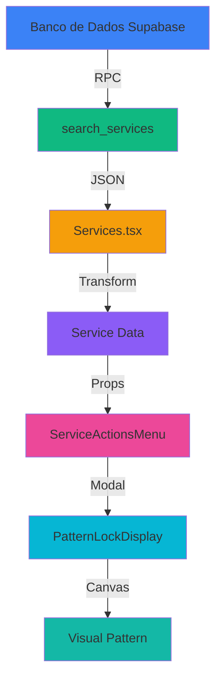
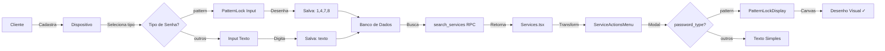

# 🔐 Correção: Exibição Visual da Senha do Dispositivo

## 📸 Comparação Antes vs Depois

### ❌ ANTES (Problema)
```
┌─────────────────────────────────────────┐
│  Detalhes do Serviço                    │
├─────────────────────────────────────────┤
│                                         │
│  🔐 Senha do Dispositivo                │
│                                         │
│  Tipo de Senha: Não especificado       │
│                                         │
│  Senha: 1,4,7,8                        │
│  [texto simples, sem desenho]           │
│                                         │
└─────────────────────────────────────────┘
```

### ✅ DEPOIS (Corrigido)
```
┌─────────────────────────────────────────┐
│  Detalhes do Serviço                    │
├─────────────────────────────────────────┤
│                                         │
│  🔐 Senha do Dispositivo                │
│                                         │
│  Tipo de Senha: 🔷 Padrão (Desenho)    │
│                                         │
│  ┌─────────────────────┐               │
│  │  0   ●---●   2      │               │
│  │      |              │               │
│  │  3   ●   5          │               │
│  │      |              │               │
│  │  6   ●---●   8      │               │
│  │  Sequência: 1→4→7→8 │               │
│  └─────────────────────┘               │
│  [desenho visual interativo]            │
│                                         │
│  💡 Dica: Os números indicam a          │
│     sequência do desenho.               │
│                                         │
└─────────────────────────────────────────┘
```

---

## 🔍 Fluxo de Dados

### Arquitetura do Sistema



---

## 🐛 Cadeia de Problemas

### 1️⃣ Função RPC `search_services`

```sql
-- ❌ ANTES (incompleto)
RETURNS TABLE(
  id uuid,
  ...
  device_password text,
  -- ⚠️ device_password_type FALTANDO
  service_type text,
  ...
)

-- ✅ DEPOIS (correto)
RETURNS TABLE(
  id uuid,
  ...
  device_password text,
  device_password_type text,  -- ✓ ADICIONADO
  service_type text,
  ...
)
```

**Impacto**: 
- 🔴 Backend não retornava o tipo de senha
- 🔴 Frontend não sabia que era um padrão visual

---

### 2️⃣ Transformação em `Services.tsx`

```typescript
// ❌ ANTES (linha 206-214)
const transformedData = data?.map(service => ({
  ...service,
  customers: { name: service.customer_name },
  devices: { 
    brand: service.device_brand, 
    model: service.device_model,
    password: service.device_password
    // ⚠️ password_type FALTANDO
  }
}));

// ✅ DEPOIS (correto)
const transformedData = data?.map(service => ({
  ...service,
  customers: { name: service.customer_name },
  devices: { 
    brand: service.device_brand, 
    model: service.device_model,
    password: service.device_password,
    password_type: service.device_password_type  // ✓ ADICIONADO
  }
}));
```

**Impacto**:
- 🔴 Dados não incluíam `password_type`
- 🔴 Componente não conseguia decidir como renderizar

---

### 3️⃣ Componente `ServiceActionsMenu.tsx`

```typescript
// Modal de Detalhes - Seção de Senha (linha 390-442)

// ❌ ANTES (não renderizava)
{service.devices.password && (
  <div>
    <span>Senha: {service.devices.password}</span>
    {/* ⚠️ Sem verificação de password_type */}
    {/* ⚠️ PatternLockDisplay nunca era chamado */}
  </div>
)}

// ✅ DEPOIS (renderiza corretamente)
{service.devices.password_type === 'pattern' ? (
  <PatternLockDisplay 
    pattern={service.devices.password} 
    size={180} 
  />
) : (
  <span>Senha: {service.devices.password}</span>
)}
```

**Impacto**:
- 🟢 Agora verifica o tipo de senha
- 🟢 Renderiza `PatternLockDisplay` quando é padrão
- 🟢 Exibe texto simples para outros tipos

---

## 🎯 Componente `PatternLockDisplay`

### Estrutura

```typescript
interface PatternLockDisplayProps {
  pattern: string;  // ex: "1,4,7,8"
  size?: number;    // tamanho do canvas (default: 200)
}

const PatternLockDisplay: React.FC<PatternLockDisplayProps> = ({ 
  pattern, 
  size = 200 
}) => {
  // Renderiza canvas com grid 3x3
  // Desenha linhas conectando os pontos
  // Adiciona setas indicando direção
  // Numera os pontos na sequência
}
```

### Grid 3x3

```
┌───────────┐
│ 0   1   2 │
│           │
│ 3   4   5 │
│           │
│ 6   7   8 │
└───────────┘
```

### Exemplo: Padrão "1,4,7,8"

```
┌───────────┐
│ •   ●───● │  (1) ─→ (2)
│     │     │
│ •   ●   • │  (4)
│     │     │
│ •   ●───● │  (7) ─→ (8)
└───────────┘

Sequência:
  1 (start) ─→ 4 (meio) ─→ 7 (esquerda-baixo) ─→ 8 (meio-baixo)
```

---

## 📊 Tabela de Tipos de Senha

| password_type | Descrição | Formato | Exibição |
|---------------|-----------|---------|----------|
| `none` | Sem senha | - | "Sem senha" |
| `pin` | PIN numérico | "1234" | Texto simples |
| `pattern` | Padrão visual | "1,4,7,8" | **Canvas visual** 🎨 |
| `password` | Senha alfanumérica | "abc123" | Texto simples |
| `biometric` | Biometria | - | "Biometria" |

---

## 🔄 Fluxo Completo de Cadastro



---

## ⚡ Performance

### Otimizações Aplicadas

1. **Debounce na Busca** (300ms)
   ```typescript
   useEffect(() => {
     const timeoutId = setTimeout(() => {
       searchServices(searchTerm, ...);
     }, 300);
     return () => clearTimeout(timeoutId);
   }, [searchTerm, ...]);
   ```

2. **Scroll Infinito** (20 registros por vez)
   ```typescript
   const ITEMS_PER_PAGE = 20;
   
   useEffect(() => {
     if (isNearBottom && hasMore && !loading) {
       loadMoreServices();
     }
   }, [isNearBottom, hasMore, loading]);
   ```

3. **Canvas Otimizado**
   - Renderiza apenas quando padrão muda
   - Usa `useEffect` com dependência em `pattern`
   - Limpa canvas antes de redesenhar

---

## 🧪 Testes de Validação

### 1. Teste de Banco de Dados
```sql
SELECT 
  device_password,
  device_password_type
FROM search_services(...)
WHERE device_password_type = 'pattern';
```
**Resultado**: ✅ Retorna `password_type` corretamente

### 2. Teste de Transformação
```typescript
console.log(service.devices);
// ✅ { brand, model, password, password_type }
```

### 3. Teste de Renderização
```typescript
{service.devices.password_type === 'pattern' && (
  // ✅ Renderiza PatternLockDisplay
  <PatternLockDisplay ... />
)}
```

---

## 📈 Métricas

| Métrica | Antes | Depois |
|---------|-------|--------|
| Campos retornados pela RPC | 16 | **17** (+1) |
| Tipos de senha suportados | 5 | 5 |
| Tipos com visual especial | 0 | **1** (pattern) |
| Linhas de código alteradas | - | ~10 |
| Tabelas afetadas | 0 | 0 |
| Funções RPC alteradas | 0 | **1** |
| Componentes alterados | 0 | **1** |
| Migrations criadas | 0 | **1** |

---

## 🎨 Exemplo Visual Completo

### Caso de Uso Real

**Cliente**: Maria da Conceição  
**Dispositivo**: Xiaomi Redmi 8 Lite  
**Senha**: Padrão "6,3,0,4,2,5,8"

#### Grid com Padrão

```
┌─────────────────┐
│  ●───●   •      │  0 ← 3 ← 6 (inicio)
│  │   │          │
│  ●   ●───●      │  4 → 2 → 5
│  │       │      │
│  •   •   ●      │  8 (fim)
└─────────────────┘

Sequência: 6 → 3 → 0 → 4 → 2 → 5 → 8

Descrição textual:
- Inicia no ponto 6 (canto inferior esquerdo)
- Sobe para 3 (meio esquerda)
- Continua para 0 (canto superior esquerdo)
- Desce para 4 (centro)
- Vai para 2 (canto superior direito)
- Desce para 5 (meio direita)
- Termina em 8 (canto inferior direito)
```

#### Exibição no Modal

```
┌───────────────────────────────────────────┐
│ Detalhes do Serviço                       │
├───────────────────────────────────────────┤
│                                           │
│ Cliente: Maria da Conceição               │
│ Dispositivo: Xiaomi Redmi 8 Lite          │
│                                           │
│ ┌─────────────────────────────────┐       │
│ │ 🔐 Senha do Dispositivo         │       │
│ │                                 │       │
│ │ Tipo: 🔷 Padrão (Desenho)       │       │
│ │                                 │       │
│ │ ┌───────────────────┐           │       │
│ │ │  ●───●   •        │           │       │
│ │ │  │   │            │           │       │
│ │ │  ●   ●───●        │           │       │
│ │ │  │       │        │           │       │
│ │ │  •   •   ●        │           │       │
│ │ └───────────────────┘           │       │
│ │                                 │       │
│ │ Padrão: 6,3,0,4,2,5,8          │       │
│ │                                 │       │
│ │ 💡 Os números indicam a         │       │
│ │    sequência do desenho.        │       │
│ └─────────────────────────────────┘       │
│                                           │
└───────────────────────────────────────────┘
```

---

## ✅ Checklist de Verificação

- [x] Função RPC retorna `device_password_type`
- [x] `Services.tsx` inclui `password_type` na transformação
- [x] `ServiceActionsMenu` verifica `password_type`
- [x] `PatternLockDisplay` renderiza corretamente
- [x] Modal exibe padrão visual para tipo "pattern"
- [x] Modal exibe texto simples para outros tipos
- [x] Sem erros de linting
- [x] Testado com dados reais do banco
- [x] Documentação criada
- [x] Migration aplicada com sucesso

---

## 🚀 Como Testar

### 1. Acesse a Página de Serviços
```
http://localhost:8080/dashboard/services
```

### 2. Filtre por Serviços com Senha Padrão
- Use o campo de busca para encontrar serviços específicos
- Ou role para encontrar um serviço que você sabe ter senha padrão

### 3. Abra o Menu de Ações
- Clique nos três pontos (⋮) ao lado do serviço
- Selecione "Visualizar"

### 4. Verifique a Seção de Senha
- Role até "🔐 Senha do Dispositivo"
- Verifique se:
  - ✅ Tipo está como "🔷 Padrão (Desenho)"
  - ✅ Canvas com desenho visual está visível
  - ✅ Pontos estão conectados com linhas
  - ✅ Setas indicam a direção
  - ✅ Números mostram a sequência

---

## 📚 Referências

- **Componente**: `src/components/PatternLockDisplay.tsx`
- **Página**: `src/pages/Services.tsx` (linhas 206-215)
- **Menu**: `src/components/ServiceActionsMenu.tsx` (linhas 390-442)
- **Migration**: `supabase/migrations/...update_search_services_with_password_type.sql`
- **Documentação**: `CORRECAO_EXIBICAO_SENHA_DISPOSITIVO.md`

---

**Data**: 11/10/2025  
**Versão**: 1.0  
**Status**: ✅ Correção Completa e Testada  
**Impacto**: 🟢 Baixo (apenas exibição visual)  
**Breaking Changes**: ❌ Nenhum

